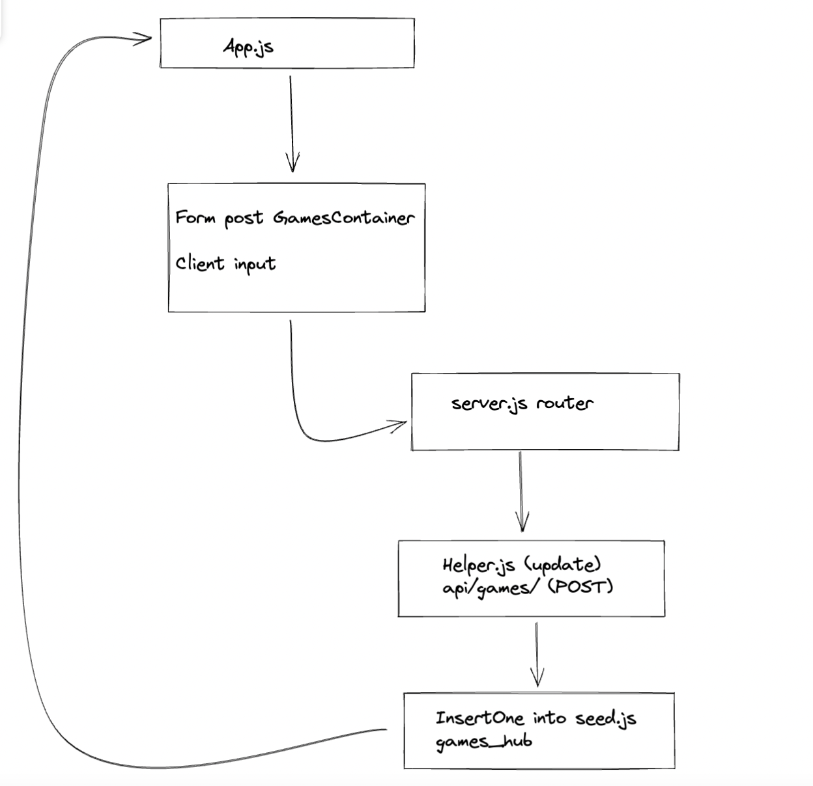

1. What is responsible for defining the routes of the `games` resource?
2. What do you notice about the folder structure?  Whats the client responsible for? Whats the server responsible for?
3. What are the the responsibilities of server.js?
4. What are the responsibilities of the `gamesRouter`?
5. What process does the the client (front-end) use to communicate with the server?
6. What optional second argument does the `fetch` method take? And what is it used for in this application? Hint: See [Using Fetch](https://developer.mozilla.org/en-US/docs/Web/API/Fetch_API/Using_Fetch) on the MDN docs
7. Which of the games API routes does the front-end application consume (i.e. make requests to)?
8. What are we using the [MongoDB Driver](http://mongodb.github.io/node-mongodb-native/) for?

1. app.use('/api/games', gamesRouter);  line 18 in server.js is responsible for defining the servers default route and the helper applies a http verb method to it. Eg Get, Post

2. The client side is responsible for displaying the information sent by the server and verifying the users input which will be sent to be stored.

The Server is responsible for committing changes to the database and sending that information back to the client side. 

3. The server.js file is responsible for handling the the users requests and linking the frontend to the database 

4. gamesRouter manages the http verbs requests related to the game_hub

5. GameService.js 

6.  second argument is an object that passes instuctions that tell the server what to do with the request.

7. baseUrl specfically the "app/games"

8. Allows our server.js to pass on the data taken from client requests and apply Crud methods through a frontend and store them in a database.

## Extension

9. We use objectID constructor so we can identify each document on the database through a unique property that no others will share. 

